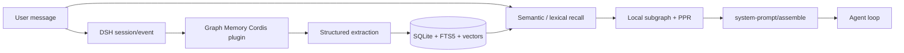
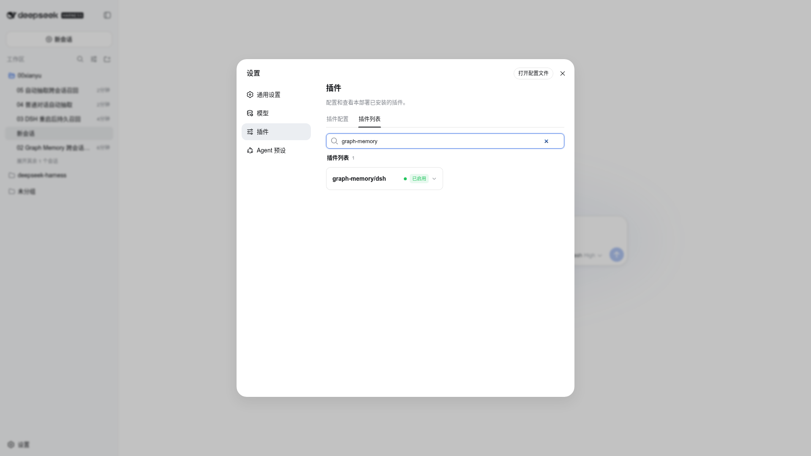
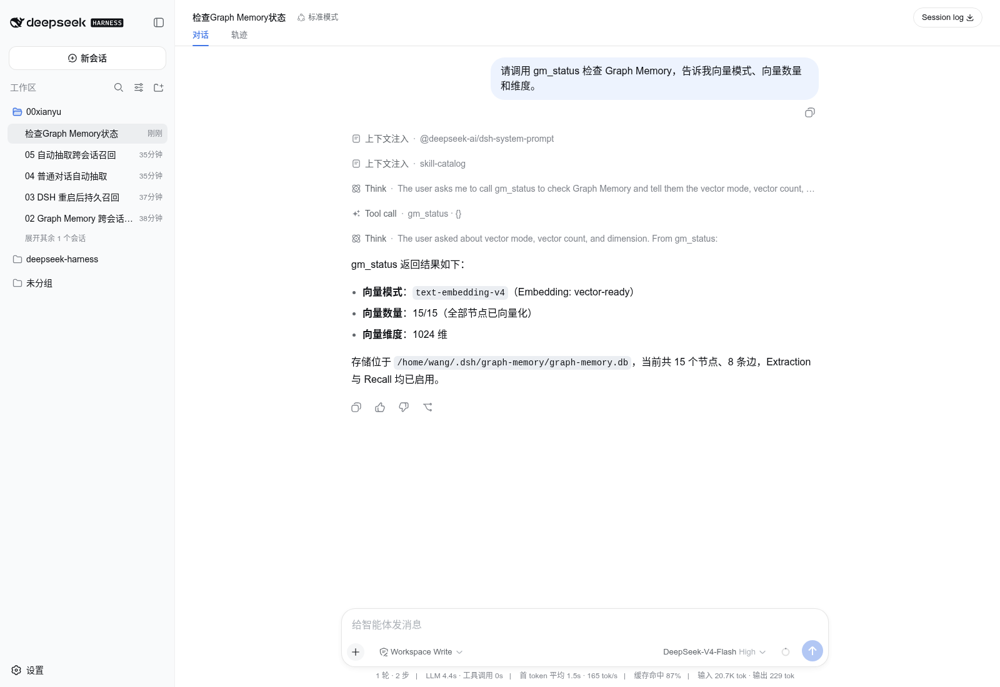
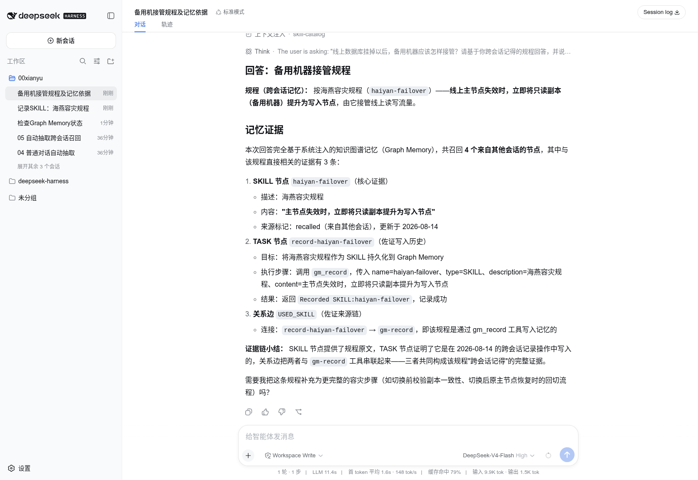
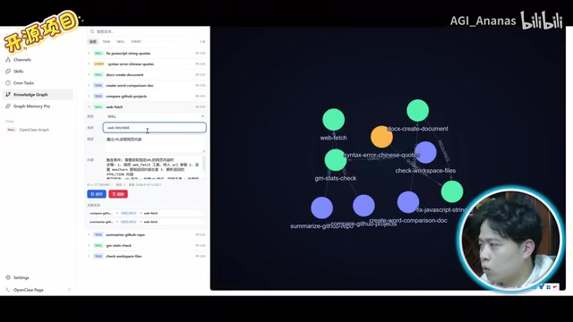

# Graph Memory


**Native knowledge-graph memory for DeepSeek Harness, with the OpenClaw adapter retained.**

[中文](README_CN.md) · [DSH architecture and Pro roadmap](docs/DSH_NATIVE_PLAN.md) · [Community demo](https://b23.tv/ebzZ9gb) · [Pro / Tsinghua talk](https://b23.tv/MIZCh0a)

> Current release target: `1.6.0-beta.1`. Native DSH loading, persistent cross-session recall, SQLite storage, and semantic vector search are tested. The DSH 3D graph workspace is a phase-two roadmap item, not a shipped Community feature.

## Why Graph Memory

Conversation compaction keeps a summary; it does not build durable, selectively retrievable knowledge. Graph Memory extracts reusable facts into `TASK`, `SKILL`, and `EVENT` nodes plus typed edges, then injects only the relevant local subgraph into a later conversation.

- Persistent cross-session memory that survives DSH restarts.
- Semantic vector retrieval with FTS5 fallback.
- Community detection, PageRank, personalized PageRank, and bounded traversal.
- Traceable source sessions and isolated prompt injection.
- Local-first SQLite storage; Neo4j is not required.
- Two host adapters: native DSH/Cordis and backward-compatible OpenClaw.

## Native DSH architecture



The adapter is loaded by Cordis and injects `tools`, `llm`, `systemPrompt`, `agentLoop`, `sessions`, and `credentials`. It closes its owned database with the Cordis fiber and does not patch DSH core source.

### DSH tools

| Tool | Purpose |
|---|---|
| `gm_status` | Native status, store path, node/edge counts, vector mode/count/dimensions |
| `gm_search` | Explicit long-term graph search |
| `gm_record` | Persist a `TASK`, `SKILL`, or `EVENT` |
| `gm_stats` | Node, edge, and community statistics |

`gm_update` and `gm_maintain` remain OpenClaw-only today.

## Install into DeepSeek Harness

For this beta, build a tarball from source and install it through the DSH CLI:

```bash
git clone https://github.com/adoresever/graph-memory.git
cd graph-memory
npm ci
npm test
npm run build
npm pack

# Run from the deepseek-harness repository, or use an installed dsh binary.
pnpm dsh plugin --profile web add /absolute/path/to/graph-memory-1.6.0-beta.1.tgz
pnpm dsh web
```

After npm publication:

```bash
dsh plugin --profile web add graph-memory@1.6.0-beta.1
dsh web
```

The plugin appears under **Settings → Plugin inventory** as `graph-memory/dsh`. You can also ask the model to call `gm_status`.



The default store is `$DSH_HOME/graph-memory/graph-memory.db`, normally `~/.dsh/graph-memory/graph-memory.db`.

## Optional embeddings

Without embedding configuration, Graph Memory falls back to FTS5. With embeddings enabled, it automatically backfills existing nodes.

The Cordis config stores only the credential reference `GRAPH_MEMORY_EMBEDDING_API_KEY`; it never stores the secret value. **Do not send API keys in a chat**, because sessions can be persisted or extracted.

DashScope OpenAI-compatible example:

```bash
export GRAPH_MEMORY_EMBEDDING_API_KEY='replace-with-your-new-key'
export GRAPH_MEMORY_EMBEDDING_BASE_URL='https://dashscope.aliyuncs.com/compatible-mode/v1'
export GRAPH_MEMORY_EMBEDDING_MODEL='text-embedding-v4'
export GRAPH_MEMORY_EMBEDDING_DIMENSIONS='1024'
dsh web
```

The adapter resolves the credential through DSH `credentials` for every operation, so rotation reaches the next request. A model or dimension change triggers re-embedding, and mixed vector dimensions are never silently compared.



## Verified DSH flow

The local DSH Web acceptance run verified:

1. Native plugin status is active.
2. All 15 existing nodes were backfilled to 15 vectors of 1024 dimensions.
3. Session A recorded a failover procedure with `gm_record`.
4. A fresh session asked a semantically equivalent question with different wording.
5. No explicit `gm_search` call was needed; the relevant SKILL, TASK, and evidence edge were injected automatically.



Automatic extraction still depends on auxiliary-model output stability. During beta, use `gm_record` for critical knowledge; failed extraction remains pending for a later retry.

## Host capability matrix

| Capability | DeepSeek Harness | OpenClaw |
|---|---:|---:|
| Native lifecycle | Cordis fiber | Plugin hooks |
| Persistent recall | ✅ | ✅ |
| SQLite / FTS5 | ✅ | ✅ |
| OpenAI-compatible embeddings | ✅ | ✅ |
| Runtime credential references | ✅ | Host-managed |
| `gm_status/search/record/stats` | ✅ | ✅ |
| `gm_update/maintain` | Planned | ✅ |
| DSH split-view 3D graph | Phase two | N/A |

## OpenClaw compatibility

The OpenClaw adapter remains supported:

```bash
openclaw plugins install graph-memory
openclaw plugins enable graph-memory
openclaw gateway restart
```

The store, extractor, recaller, and graph algorithms are host-neutral. `dsh.ts` and `index.ts` are adapters, so DSH development does not strand existing OpenClaw users.

## From a Tsinghua talk to the DSH ecosystem

Graph Memory was publicly demonstrated as an OpenClaw plugin and as a Pro knowledge-graph system. The next chapter is a native DSH plugin and, later, a Cordis client workspace.

- [Community cross-session memory demo](https://b23.tv/ebzZ9gb)
- [Pro Neo4j graph and Tsinghua sharing video](https://b23.tv/MIZCh0a)

“Tsinghua sharing” describes the author's technical sharing experience; it does not imply endorsement by Tsinghua University or DeepSeek.

## Pro phase two: 3D graph and drag-to-context



The image above is a frame from the existing Pro/OpenClaw demo and is not a completed DSH UI. The planned DSH client plugin will provide:

- Conversation and searchable 2D/3D memory graph in a split view.
- Memory, Session, Skill, MCP Server, and Tool nodes without storing secrets.
- Controlled drag-to-context: the client drops node IDs, the host validates and loads content, and a durable session event records the action.
- SQLite as the default graph backend; no mandatory Neo4j install.
- Optional Neo4j/GDS for very large graphs, multi-user deployments, and advanced graph analytics.

See [DSH_NATIVE_PLAN.md](docs/DSH_NATIVE_PLAN.md) for interfaces, milestones, and acceptance criteria.

## Development

```bash
npm ci
npm test       # 107 tests
npm run build
```

Before release: run tests and build, inspect the tarball for `dsh.ts`, `cordis.patch.yml`, and docs, and scan for API keys or local databases.

## Privacy and security

- Memory is local SQLite by default.
- Recalled history is marked untrusted reference material; current user instructions win.
- Secrets belong in host credentials or environment variables, never in README, Cordis patches, logs, or the database.
- Rotate any credential that has appeared in chat, screenshots, or terminal output.

## License

[MIT](LICENSE) © 2026 adoresever

See [docs/ATTRIBUTIONS.md](docs/ATTRIBUTIONS.md) for asset and trademark notes.
