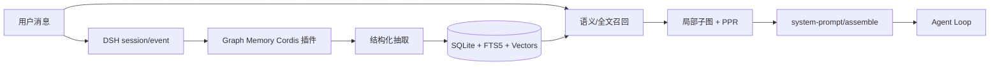

# Graph Memory


**面向 DeepSeek Harness 的原生知识图谱记忆插件，同时保留 OpenClaw 兼容入口。**

[English](README.md) · [DSH 原生架构与 Pro 路线图](docs/DSH_NATIVE_PLAN.md) · [演示视频](https://b23.tv/ebzZ9gb) · [Pro / 清华分享](https://b23.tv/MIZCh0a)

> 当前版本：`1.6.0-beta.1`。DSH 原生适配、跨会话召回、SQLite 持久化和向量检索已经实测；DSH 前端 3D 图谱仍属于第二阶段路线图，不是当前开源版已交付功能。

## 它解决什么问题

普通会话压缩只保留一段摘要，跨会话复用仍然弱，而且容易把无关上下文重新塞回模型。Graph Memory 把可复用信息提取成 `TASK`、`SKILL`、`EVENT` 节点及带类型的关系边，在下一次对话中只召回与当前问题相关的局部子图。

- 跨会话持久记忆：关闭或重启 DSH 后仍可召回。
- 双路检索：向量语义检索与 FTS5 全文检索自动降级。
- 图排序：社区发现、PageRank、个性化 PageRank 与深度限制。
- 可追溯：节点保留来源会话，召回内容以独立上下文注入。
- 本地优先：SQLite 默认存储在用户目录，不要求 Neo4j。
- 双宿主：DSH 使用 Cordis 原生插件入口；OpenClaw 入口继续保留。

## DSH 原生集成

Graph Memory 不是通过 MCP 旁路模拟插件，而是由 DSH/Cordis 直接加载：



插件通过 Cordis 依赖注入使用 `tools`、`llm`、`systemPrompt`、`agentLoop`、`sessions` 和 `credentials`，并在 fiber 卸载时关闭数据库。它不修改 DSH 核心源代码。

### 当前 DSH 工具

| 工具 | 用途 |
|---|---|
| `gm_status` | 查看原生加载状态、数据库、节点/边、向量模式、数量和维度 |
| `gm_search` | 主动搜索跨会话知识图谱 |
| `gm_record` | 显式写入 `TASK` / `SKILL` / `EVENT` |
| `gm_stats` | 查看节点、边、社区统计 |

`gm_update` 与 `gm_maintain` 目前仍是 OpenClaw 入口能力，不能把它们当成 DSH 已实现工具。

## 60 秒安装到 DeepSeek Harness

当前 beta 建议从源码打包安装。安装动作走 DSH CLI，不是在对话框里粘贴代码：

```bash
git clone https://github.com/adoresever/graph-memory.git
cd graph-memory
npm ci
npm test
npm run build
npm pack

# 在 deepseek-harness 仓库中运行；也可以使用已安装的 dsh 命令
pnpm dsh plugin --profile web add /absolute/path/to/graph-memory-1.6.0-beta.1.tgz
pnpm dsh web
```

发布到 npm 后，安装命令会简化为：

```bash
dsh plugin --profile web add graph-memory@1.6.0-beta.1
dsh web
```

安装成功后可以在 DSH 的“设置 → 插件清单”看到 `graph-memory/dsh`，也可以在对话中让模型调用 `gm_status`。


默认数据库：

```text
$DSH_HOME/graph-memory/graph-memory.db
```

未设置 `DSH_HOME` 时通常是 `~/.dsh/graph-memory/graph-memory.db`。

## 配置 Embedding

Embedding 是可选项。未配置时自动使用 FTS5；配置后启用语义向量召回，并在启动时为旧节点补齐向量。

DSH 配置只保存凭据引用 `GRAPH_MEMORY_EMBEDDING_API_KEY`，不会保存密钥值。**不要把 API key 发到对话框**，因为会话可能被持久化或进入记忆抽取。

以 DashScope OpenAI-compatible 接口为例：

```bash
export GRAPH_MEMORY_EMBEDDING_API_KEY='replace-with-your-new-key'
export GRAPH_MEMORY_EMBEDDING_BASE_URL='https://dashscope.aliyuncs.com/compatible-mode/v1'
export GRAPH_MEMORY_EMBEDDING_MODEL='text-embedding-v4'
export GRAPH_MEMORY_EMBEDDING_DIMENSIONS='1024'
dsh web
```

如果使用源码版 DSH：

```bash
pnpm dsh web
```

插件通过 DSH `credentials` 服务在每次请求时解析凭据，因此轮换密钥后下一次 embedding 操作即可生效。切换模型或维度会触发旧节点重新向量化；不同维度的向量不会被静默混算。


## 已验证的真实链路

本机 DSH Web 验收结果：

1. 原生插件在插件清单中处于 active。
2. 15 个已有节点启动后自动回填为 15 个 1024 维向量。
3. 在会话 A 用 `gm_record` 写入“主节点失效时，将只读副本提升为写入节点”。
4. 在全新会话 B 用“线上数据库挂掉以后，备用机器怎样接管？”提问。
5. 问题没有复用原句，也没有显式调用 `gm_search`；Graph Memory 仍自动注入对应 SKILL、TASK 和关系证据。


自动抽取仍受模型输出稳定性影响，因此 beta 阶段建议对关键知识使用 `gm_record`；抽取失败的消息会保留为未提取状态，后续可以重试。

## DSH 与 OpenClaw 能力矩阵

| 能力 | DeepSeek Harness | OpenClaw |
|---|---:|---:|
| 原生生命周期 | Cordis fiber | Plugin hooks |
| 跨会话记录与召回 | ✅ | ✅ |
| SQLite / FTS5 | ✅ | ✅ |
| OpenAI-compatible embedding | ✅ | ✅ |
| 凭据引用、运行时解析 | ✅ | 由宿主配置管理 |
| `gm_status/search/record/stats` | ✅ | ✅ |
| `gm_update/maintain` | 规划中 | ✅ |
| DSH 3D 分屏图谱 | 第二阶段 | 不适用 |

## OpenClaw 兼容入口

OpenClaw 没有被删除。原有 `index.ts`、`openclaw.plugin.json` 和运行时行为继续保留：

```bash
openclaw plugins install graph-memory
openclaw plugins enable graph-memory
openclaw gateway restart
```

Graph Memory 的存储、抽取、召回和图算法是宿主无关核心；`dsh.ts` 与 `index.ts` 只是不同宿主适配器。因此后续升级 DSH 不需要牺牲已有 OpenClaw 用户。

## 从清华分享到 DSH 生态

Graph Memory 曾以 OpenClaw 插件与 Pro 知识图谱形态进行公开分享。现在项目进入第二阶段：把已经验证的记忆算法迁移为 DSH 原生插件，并逐步利用 Cordis 的客户端插件能力建设可视化工作台。

- [开源版：跨会话记忆与上下文去噪演示](https://b23.tv/ebzZ9gb)
- [Pro：Neo4j 知识图谱与清华分享视频](https://b23.tv/MIZCh0a)

这里的“清华分享”描述的是作者的技术分享经历，不表示清华大学或 DeepSeek 对本项目的官方背书。

## Pro 第二阶段：3D 图谱与拖拽上下文


上图是现有 Pro/OpenClaw 视频素材，用于说明目标体验，并非 DSH 前端已经完成的截图。DSH 版本计划作为独立客户端插件进入会话分屏：

- 左侧保持对话，右侧展示可搜索的 2D/3D 记忆图谱。
- 节点覆盖记忆、Session、Skill、MCP Server 和 Tool，但不保存密钥。
- 把节点拖入输入区时只提交受控的节点 ID；Host 校验后加载内容，并写入可追溯 session event。
- 默认使用 SQLite 图存储即可，不强制安装 Neo4j。
- Neo4j/GDS 作为可选 Pro 后端，用于超大图、多用户和复杂图分析。

完整分期、接口边界和验收标准见 [DSH_NATIVE_PLAN.md](docs/DSH_NATIVE_PLAN.md)。

## 开发

```bash
npm ci
npm test       # 当前 107 项
npm run build
```

发布前必须确认：测试与构建通过、tarball 包含 `dsh.ts`/`cordis.patch.yml`/文档、仓库不存在 API key 或本地数据库。

## 隐私与安全

- 数据默认保存在本机 SQLite。
- 召回内容被标记为“不可信历史参考”，当前用户指令始终优先。
- API key 只通过宿主凭据系统或环境变量提供，不写入 README、Cordis patch、日志或数据库。
- 如果密钥曾出现在聊天、截图或终端输出中，应立即在供应商控制台轮换。

## License

[MIT](LICENSE) © 2026 adoresever

素材与商标说明见 [docs/ATTRIBUTIONS.md](docs/ATTRIBUTIONS.md)。
