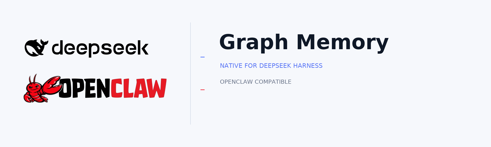
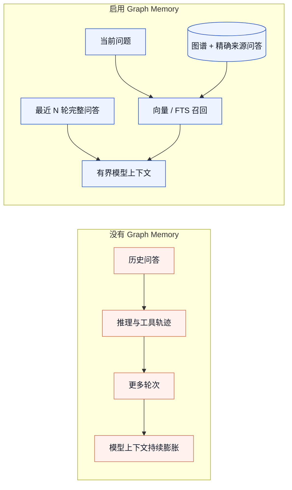
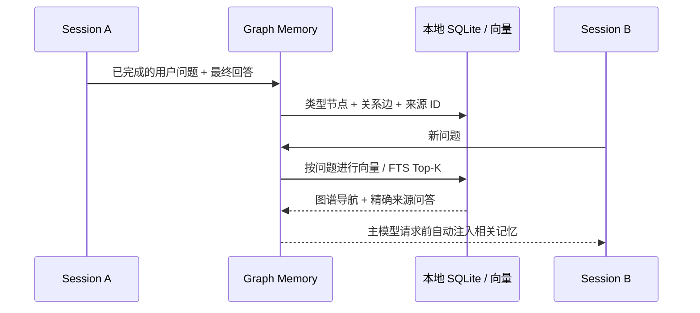
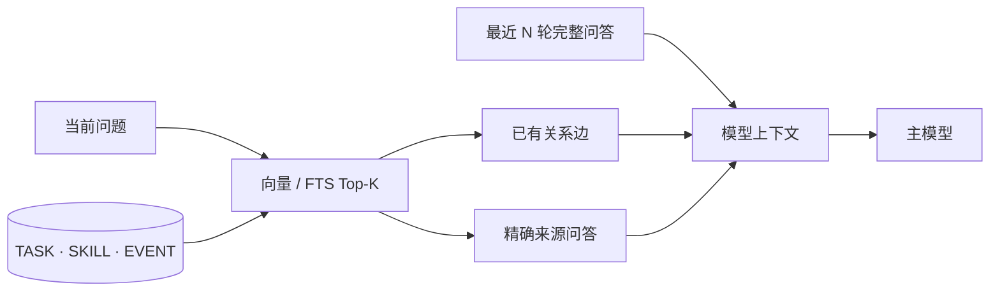

# Graph Memory

<p align="center">
  
</p>

<p align="center">
  <strong>限制上下文，让记忆继续生长。</strong><br>
  Graph Memory 原生接管 DeepSeek Harness 的模型可见历史：保留最近对话，把旧历史变成可检索图记忆，并在需要时召回精确来源。
</p>

<p align="center">
  <a href="README.md">English</a> ·
  <a href="https://www.dsh.so/zh/artifact/graph-memory">dsh.so</a> ·
  <a href="benchmarks/dsh-context-takeover/README.md">20 轮实测</a> ·
  <a href="docs/DSH_NATIVE_PLAN.md">架构文档</a>
</p>

<p align="center">
  <a href="https://www.dsh.so/zh/artifact/graph-memory"></a>
  <a href="https://www.dsh.so/zh/artifact/graph-memory"></a>
</p>

## 它解决什么



Graph Memory 接管的是**发给模型的历史表面**，不会删除 DSH 的事件记录。默认保留最近 5 个已完成用户轮次；已完成的推理和工具轨迹不再重复发送；旧轮次与跨会话记忆按当前问题自动召回。

## 先看真实结果

<p align="center">
  
</p>

| GLM-5.2 真实 20 轮测试 | 原生 DSH | DSH + Graph Memory | 变化 |
|---|---:|---:|---:|
| 第 20 轮首请求 | 56,998 Token | **16,769 Token** | **−70.58%** |
| 第 20 轮模型可见消息 | 171 | **24** | **−85.96%** |
| 20 轮首请求上下文累计 | 532,451 Token | **257,656 Token** | **−51.61%** |
| 全部实测 Token¹ | 2,487,776 | **2,401,512** | **−3.47%** |

<sub>¹ 包含主 Agent 随机工具循环、20 次图谱抽取和 125 次 Embedding 请求。上下文接管看首请求；完整账单同时公开，避免夸大节省。</sub>

**20/20** 轮任务通过 · **19/20** 次结构化抽取成功 · **42** 节点 · **55** 边 · **42** 向量 · 新 Session 无需 gm_search 即召回最终事实。

[查看 Markdown 实测报告、逐轮数据、方法与限制 →](benchmarks/dsh-context-takeover/README.md)

## 上下文可以缩小，记忆不会消失



<p align="center">
  
  
</p>

图谱只是**导航层**，不是拿摘要代替证据。TASK、SKILL、EVENT 节点会指回原始用户问题和最终可见回答，召回时把这些精确来源一起交给模型。

## 安装到 DeepSeek Harness

Node.js 22.13+ · 不 fork DSH · 当前 beta 可直接从 GitHub 安装：

```bash
npx @deepseek-ai/dsh plugin --profile web add github:adoresever/graph-memory
npx @deepseek-ai/dsh --profile web --dump-config
npx @deepseek-ai/dsh web
```

在 **Settings → Plugins** 确认 graph-memory/dsh 已启用。默认数据库位于 $DSH_HOME/graph-memory/graph-memory.db，通常是 ~/.dsh/graph-memory/graph-memory.db。

## 已交付能力

| 能力 | 实现方式 |
|---|---|
| 上下文接管 | 最近 N 个完成轮次可配置；旧模型表面由一个归档标记替换 |
| 轻量抽取 | 只处理用户问题与最终回答；严格结构化工具合同；不摄入推理/工具轨迹 |
| 查询优先召回 | 向量 Top-K，FTS5 降级；图谱命中携带精确来源问答 |
| 持久记忆 | 本地 SQLite、稳定溯源、跨轮次/跨会话/跨项目召回 |
| 失败行为 | 非法抽取进入隔离；前台对话继续；坏数据不修补、不入库 |
| 宿主支持 | DSH/Cordis 原生适配；继续维护 OpenClaw Context Engine 适配 |



<details>
<summary><strong>可选 Embedding</strong></summary>

支持 OpenAI-compatible Embedding。没有配置向量时自动降级到 FTS5，不阻塞对话。

```bash
export GRAPH_MEMORY_EMBEDDING_API_KEY="replace-with-your-key"
export GRAPH_MEMORY_EMBEDDING_BASE_URL="https://dashscope.aliyuncs.com/compatible-mode/v1"
export GRAPH_MEMORY_EMBEDDING_MODEL="text-embedding-v4"
export GRAPH_MEMORY_EMBEDDING_DIMENSIONS="1024"
dsh web
```

</details>

<details>
<summary><strong>DSH 工具与独立抽取模型</strong></summary>

| 工具 | 用途 |
|---|---|
| gm_status | 存储、抽取、召回、向量与保留状态 |
| gm_search | 显式搜索图记忆 |
| gm_record | 确定性写入 TASK、SKILL 或 EVENT |
| gm_stats | 图谱与保留策略回执 |
| gm_maintain | 执行一次有界维护 |
| gm_retry_extraction | 显式重试隔离的抽取任务 |

自动召回不需要工具调用。抽取可通过 GRAPH_MEMORY_LLM_PROVIDER 和 GRAPH_MEMORY_LLM_MODEL 使用独立模型；可选控制项为 GRAPH_MEMORY_LLM_REASONING_EFFORT 与 GRAPH_MEMORY_LLM_MAX_TOKENS。

</details>

<details>
<summary><strong>OpenClaw 兼容</strong></summary>

```bash
openclaw plugins install graph-memory
openclaw plugins enable graph-memory
openclaw gateway restart
```

在 ~/.openclaw/openclaw.json 激活 Context Engine：

```json
{
  "plugins": {
    "slots": { "contextEngine": "graph-memory" },
    "entries": { "graph-memory": { "enabled": true } }
  }
}
```

<p align="center">
  
</p>

</details>

<details>
<summary><strong>Graph Memory Pro</strong></summary>

仓库包含实验性的 DSH Pro Lite Host + Client，只读读取 Community SQLite。2D/3D 图工作台、对话分屏与受控拖入上下文仍在规划中。详见 [dsh-pro/README_CN.md](dsh-pro/README_CN.md)。

</details>

## 验证与边界

当前 beta 1.6.0-beta.12 已通过 **123/123 自动化测试**、两套 TypeScript 构建、npm 包验证，并在官方 DSH 0.1.3-alpha.1（d347e70390）完成全新 profile 安装和启动。

- 结构化抽取仍依赖模型遵守合同：实测 19/20 成功；失败数据保持隔离，且不会阻塞前台对话。
- 召回数量由 Top-K 限制。聚焦问题实测成功；一次包含多个主题的宽查询可能需要提高 Top-K 或拆开提问。
- 当前发布的是工程工作流实测，不是 LoCoMo/LongMemEval 的通用分数。

从 [benchmarks/dsh-context-takeover/](benchmarks/dsh-context-takeover/) 复跑。原始对话、供应商响应、本地路径和密钥均未进入仓库。

## 开发

```bash
npm install
npm test
npm run build
npm run verify:package
```

[MIT](LICENSE) © 2026 adoresever · [素材与商标说明](docs/ATTRIBUTIONS.md)
